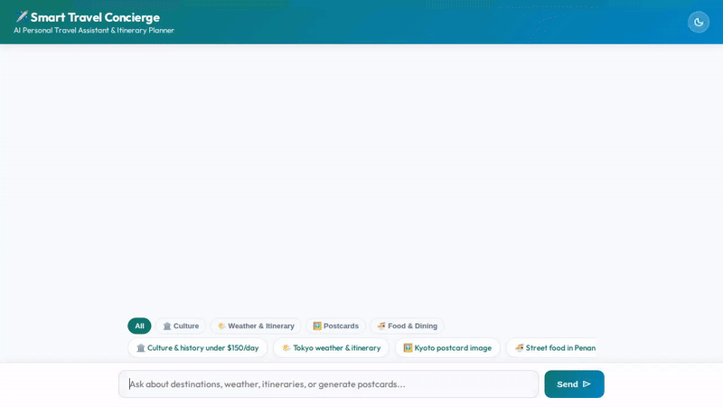

# Smart Travel Concierge

An AI-powered personalized travel concierge application built using Google's **Agent Development Kit (ADK)**, **Gemini 2.5**, **Vertex AI Memory Bank**, **Firestore**, **Google Cloud Storage**, **Imagen 3**, **Gemini Omni**, and **A2UI**.



---

## 🌟 Features & Implemented Capabilities

This repository contains the complete implementation of the Smart Travel Concierge agent and its lightweight FastAPI web frontend. The system includes the following verified features:

* **Structured A2UI Interface**: Uses A2UI (v0.8) protocol with `A2uiSchemaManager` and `BasicCatalog` to render clean, component-driven UI cards (`Card`, `Column`, `Row`, `Text`, `Image`) in the chat interface.
* **Long-Term Memory Bank**: Powered by **Vertex AI Memory Bank Service**, `PreloadMemoryTool`, and `LoadMemoryTool`. Automatically remembers user travel preferences (`remember_travel_preference`) and food/environmental allergies (`remember_user_allergy`) across sessions.
* **Firestore Destination Catalog**: Integrates with Google Cloud Firestore to query destination recommendations filtered by daily budget, travel style, and activity categories.
* **Imagen 3 Postcard Generation**: Generates high-resolution destination postcards using Google's `imagen-3.0-generate-002` model via Vertex AI, saves them as ADK artifacts, and serves them via public Cloud Storage.
* **Gemini Omni Video Generation**: Generates short travel scene preview videos using Google's `gemini-omni-flash-preview` model in the `global` region, saving ADK artifacts and uploading MP4s to Google Cloud Storage.
* **Public Google Cloud Storage Bucket**: Uploads generated postcard images (`/postcards/`) and video previews (`/videos/`) to a public GCS bucket (`smart-travel-concierge-media-*`) and returns direct HTTPS media URLs.
* **Real-Time Geocoding & Weather**: Provides live destination weather forecasts (`get_real_city_weather`) and location coordinates (`geocode_address`).
* **Trip Budgeting & Currency Conversion**: Calculates itemized travel budgets (`calculate_trip_budget`) and converts currency values (`convert_currency`).
* **Agent Engine Sandbox Code Executor**: Runs Python code safely within an isolated `AgentEngineSandboxCodeExecutor` environment to compute complex travel itineraries and financial calculations.
* **Rebranded Ocean Teal Web UI**: Lightweight FastAPI frontend featuring:
  * Ocean Teal gradient header theme
  * Light / Dark mode color scheme switcher
  * Category filter tabs (🏛️ Culture, 🌤️ Weather, 🖼️ Postcards, 🍜 Food)
  * Tailored quick-prompt chips
  * Animated 3-dot typing indicator
  * Interactive image lightbox modal with download capability

---

## 🛠️ Tech Stack & Google Cloud Services

* **Framework**: Google Agent Development Kit (ADK)
* **Model**: Gemini 2.5 (`gemini-flash-latest`), Imagen 3 (`imagen-3.0-generate-002`), Gemini Omni (`gemini-omni-flash-preview`)
* **Databases & Memory**: Google Cloud Firestore, Vertex AI Memory Bank
* **Storage**: Google Cloud Storage (Public Bucket)
* **Code Execution**: Vertex AI Agent Engine Sandbox
* **Protocol**: A2UI (Agent to UI) Schema v0.8
* **Frontend**: Python FastAPI, Vanilla HTML5/CSS3/JavaScript

---

## 🚀 Setup & Local Execution

### Prerequisites

* Python 3.10+ and [`uv`](https://github.com/astral-sh/uv) package manager
* Google Cloud SDK (`gcloud`) logged in with appropriate GCP project permissions

### Installation

1. Install project dependencies using `uv`:

   ```bash
   uv sync
   ```

2. Create a local `.env` file in the repository root using `.env.example` as a reference. Copy the example, then edit `.env` and replace the placeholder values with your own configuration and credentials:

   ```bash
   cp .env.example .env
   ```

   On Windows PowerShell, use `Copy-Item .env.example .env`. Keep `.env` local and never commit or share it; it is excluded by `.gitignore`. Refer to `.env.example` for the environment variable names and expected format. Set any required values that are not listed there in your shell or deployment environment.

### Running the Local Agent Playground

To interact with the agent using the ADK Playground CLI:

```bash
agents-cli playground
```

### Running the Web Frontend Locally

1. Navigate to the `frontend/` directory:

   ```bash
   cd frontend
   ```

2. Install frontend dependencies:

   ```bash
   pip install -r requirements.txt
   ```

3. Start the FastAPI local server:

   ```bash
   AGENT_ENGINE_RESOURCE_NAME="<YOUR_AGENT_ENGINE_RESOURCE_NAME>" AGENT_DIRECTORY="app" python main.py
   ```

4. Open `http://localhost:8080` in your web browser.

---

## ☁️ Deployment

### Deploying the Agent to Agent Platform

Deploy the agent using `agents-cli`:

```bash
agents-cli deploy --update-env-vars GOOGLE_MAPS_API_KEY=<YOUR_KEY> --no-confirm-project
```

### Deploying the Frontend to Cloud Run

Build and deploy the FastAPI proxy and chat UI to Cloud Run:

```bash
gcloud run deploy smart-travel-concierge-ui \
  --source ./frontend \
  --set-env-vars AGENT_ENGINE_RESOURCE_NAME="<YOUR_RESOURCE_NAME>",AGENT_DIRECTORY="app" \
  --region us-east1 \
  --allow-unauthenticated
```
